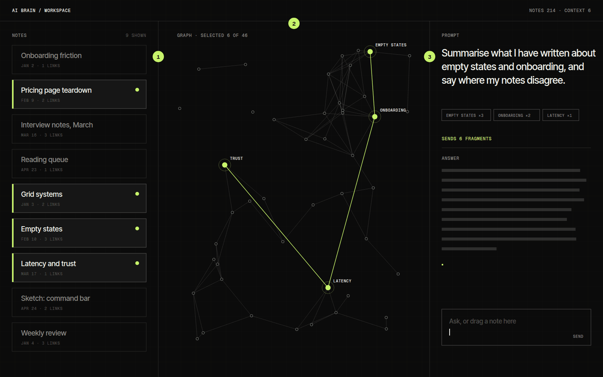
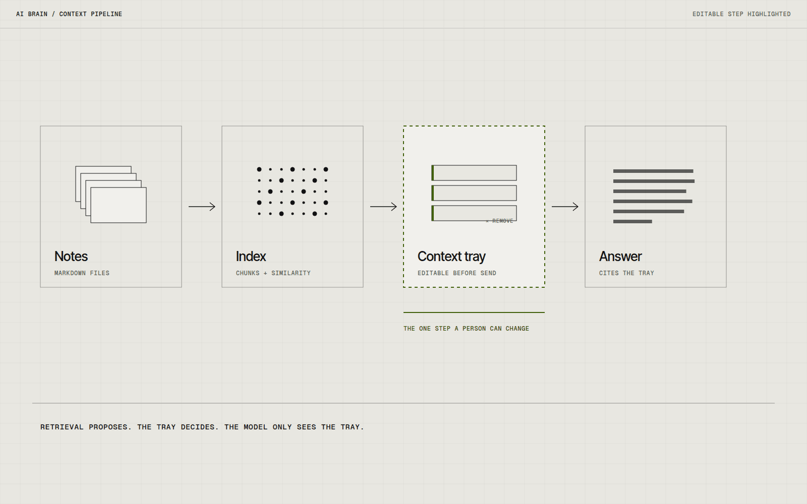

# AI Brain

AI Brain is a workspace experiment where my own notes sit underneath the prompt box. Instead of pasting context into a chat, I wanted the notes to be something I can point at, pull from and watch being used. The question was what an AI interface looks like when its memory is visible.

## Overview

The prototype has three parts: a tray of notes on the left, a graph of how those notes link in the middle, and a prompt panel on the right. When I write a prompt, the notes that will be pulled into it light up in the graph before anything is sent.

It is a working prototype that runs against a folder of Markdown notes. There is no public demo, because the notes it reads are private, so the interaction is documented here instead.

## The idea

Most chat interfaces treat context as something you supply each time. My notes already hold a lot of half-formed thinking, and I kept copying paragraphs out of them into prompts. I wondered what would change if the notes were the starting material and the prompt was closer to a pointer into them.

## What I was testing

- Whether showing which notes go into a prompt makes the answer easier to trust, or easier to reject.
- Whether a graph of links is a better way to choose context than a search box.
- How quiet the interface can be when the model is not answering.

## Process

I started with plain text files and a simple similarity search over chunks of each note. The first interface was an ordinary chat window with a list of sources under every answer, and I always read that list after the fact, when it was too late to matter.

Moving the sources in front of the answer, as a tray I can edit before sending, changed how I wrote prompts. I began deleting irrelevant notes from the tray instead of rewording the question.

The graph came second. It began as a debugging view for the search, and I kept it because seeing two distant notes joined by a shared phrase was often more useful than the answer itself.

*Caption: Notes selected for a prompt are highlighted in the tray and in the graph before anything is sent.*

## Result

The tray, graph and prompt panel all exist and stay in sync. Selecting a node adds its note to the tray, removing a note from the tray dims it in the graph, and the prompt always shows how many fragments it will send.

It is not packaged for anyone else. Setup assumes a folder of Markdown files and an API key, and search quality drops when notes are very short.

*Caption: The editable tray sits between retrieval and the model. That single step is the whole interface idea.*

## Learnings

- Editable context is more useful than cited context. Sources listed after an answer are evidence; sources shown before it are a control.
- The graph helps with choosing, but it gets noisy quickly. Past a few hundred notes it needs filtering before it is readable.
- Next I want to test writing a note directly from an answer, so the graph grows from use instead of import.

## Notes

The model is treated as a replaceable part. Nothing in the interface depends on a specific provider, which made it easier to compare how different models behaved with exactly the same tray.

## Stack

- Next.js
- TypeScript
- OpenAI API
