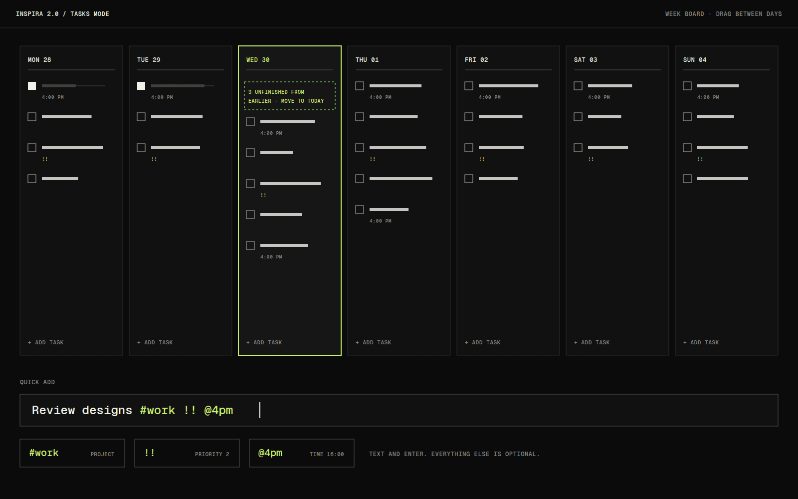

# Inspira 2.0

Inspira 2.0 replaces Chrome's new tab page with a calm clock, one line of daily inspiration and the weather, and keeps a small personal workspace behind it: a pomodoro timer, a week task board and a calendar. The guardrail I set was that the default tab should never look like a productivity app.

## Overview

The extension has five modes, each on one key: Clock, Quote, Focus, Tasks and Calendar. The date is the backbone. Every task, note and event belongs to a day, so moving through time is the main way of moving around.

It works without an account. Data syncs through the Chrome profile, and the calendar comes from a private iCal link, so there is no server to run.

## The idea

This is a rebuild of an existing extension. The original source and store assets were not available when I built it, so I worked from a list of what it did: a large clock, quotes in categories, a focus mode, light and dark themes, animation and keyboard shortcuts.

The question underneath was how much workspace can sit behind a clock before the new tab stops feeling calm.

## What I was testing

- Whether a hidden dock and number keys are enough navigation for five modes.
- Whether schedule, tasks and notes can share a date and nothing else, instead of being merged into one list.
- Whether a new tab page can sync across computers with no server and no sign-in.

## Process

I started from capture. A task is text and Enter, and everything else (time, priority, project, reminder) sits behind a menu. Quick-add tokens such as `#work !! @4pm` give faster entry without adding interface.

Unfinished work carries over visibly. Today's column says how many tasks are unfinished from earlier days and offers to move them, but nothing moves on its own, so past days stay truthful.

Sync was the constraint that shaped the most code. Chrome's sync storage holds about 100 KB and 8 KB per item, so the data is packed into chunks and merged record by record, and a missing record is never treated as a deletion.

*Caption: A schematic of the Tasks mode. Unfinished work from earlier days is offered, never moved automatically.*

## Result

All five modes exist, with light, dark and automatic themes, texture, grid and shader backdrops, projects, notes, reminders, keyboard shortcuts, and JSON export and import. The package keeps its permissions to storage and alarms, with notifications requested only on first use, and the unit tests check that.

One command packages it for the Chrome Web Store, but I am calling it building until a release goes out.

## Learnings

- Permissions are part of the design. An update that adds a permission warning can get an extension disabled for existing users, so notifications are optional and location is a one-off browser prompt.
- The 100 quotes are original lines. That avoids the misattribution problem common in quote apps.
- Recurring tasks and creating calendar events are the next real gaps, and the second needs a broader Google scope.

## Notes

The visual language is a best-fit interpretation, because the original assets were missing. Everything identity-specific lives in one token file so it can be swapped to match the shipped look.

## Stack

- JavaScript (ES modules)
- Chrome Extension, Manifest V3
- WebGL
