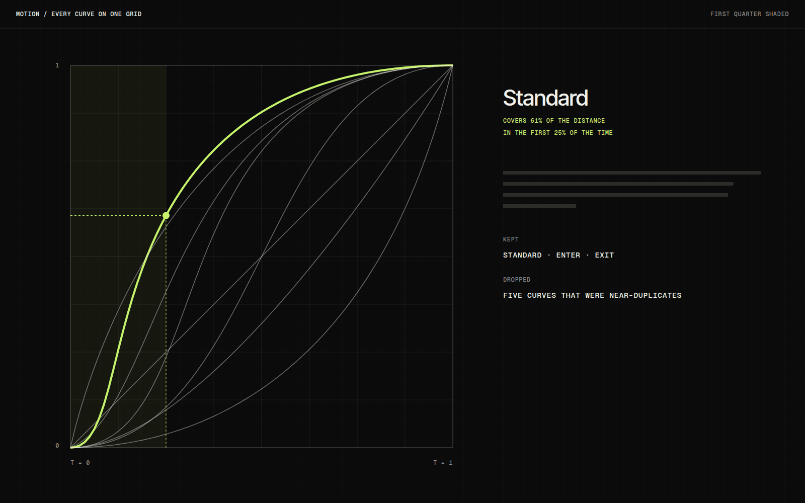
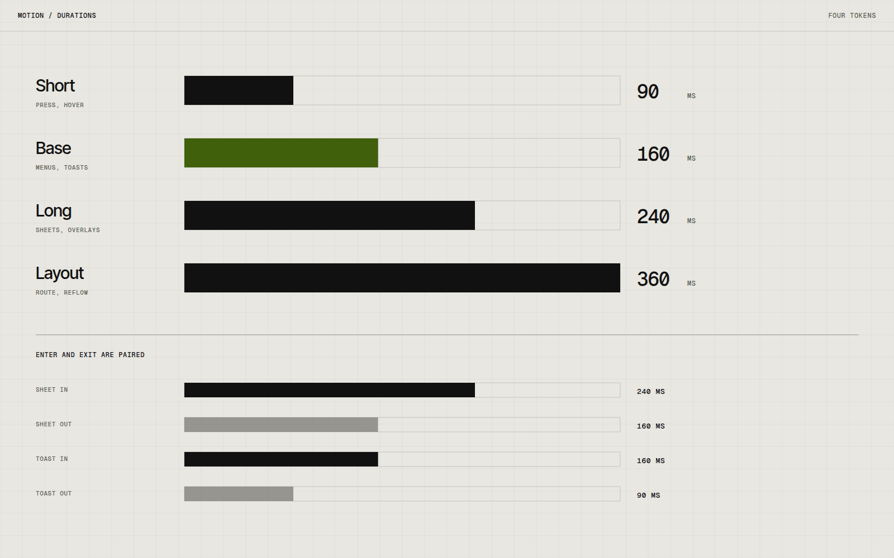

# Motion System

Motion System is a small set of timing and easing rules for interface transitions and feedback. I wanted to find out how few motion values could cover a whole product, and to write them down as tokens that a developer can use without opening a prototype.

## Overview

The system has four durations, three easing curves and a short list of rules about when each applies. It is documented as a reference sheet and as a page of live examples where every value can be replayed side by side.

## The idea

On past projects, motion ended up as a pile of one-off values: a 200ms here, a 250ms there, curves copied from whichever library was closest. Nothing was wrong with any single one, but the product never felt like it moved as one thing.

I wanted to see how small the set could get before it stopped being useful.

## What I was testing

- Whether four durations are enough to cover small feedback, entrances, exits and large layout changes.
- Whether exits should always be faster than entrances, as a rule instead of a matter of taste.
- Whether motion can be specified as tokens, so a developer never needs a prototype to know what to write.

## Process

I listed every transition in a sample product: hover, press, menu open, sheet, toast, route change. Then I grouped them by distance travelled and by how much attention they ask for, and only afterwards chose durations.

Curves came from plotting them on the same grid and looking at where the first quarter of the movement went. A curve that does most of its work early feels responsive; one that lingers at the start feels heavy, whatever its total duration.

*Caption: Plotting every curve on one grid made it obvious which ones were duplicates.*

## Result

The reference sheet and the live examples page both exist. Durations and curves are exposed as CSS custom properties, and the examples page reads from the same variables, so a change to a token moves every demo at once.

*Caption: Exits use the next shorter duration than the matching entrance.*

## Learnings

- The enter and exit asymmetry mattered more than the exact curve. Getting that one rule right removed most of the heaviness.
- Fixed tokens expose slow code. When a transition cannot be shortened, something other than the animation is usually the problem.
- Reduced motion should be its own set of tokens rather than an exception list. That is the next thing I want to build.

## Notes

Under a reduced-motion preference, every duration collapses to close to zero while the order of changes stays the same. The interface still tells you what happened; it just does not perform it.

## Stack

- CSS
- TypeScript
- Figma
