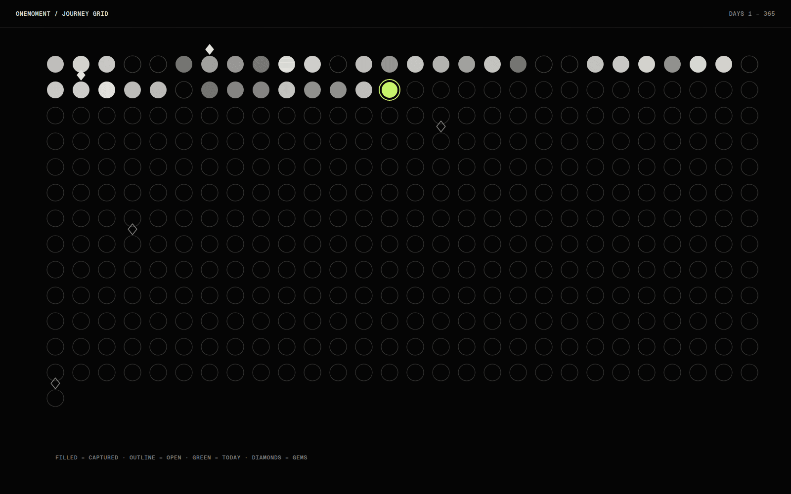

# OneMoment

OneMoment is an iOS app that gives me one photography prompt a day for 365 days. I take a photo, it joins a journey, and at the end of the year there is a personal visual record. I wanted a camera habit without any of the social machinery: no feed, no followers, no likes.

## Overview

The app is built around a daily loop: see the prompt, capture, and watch the journey grow. The journey is shown two ways, as a grid of days and as a constellation, with milestones called gems and a streak alongside.

All journey data stays on the device. The server side holds only the sign-in identity, through email links, Google and Apple.

## The idea

Photo apps are social by default, and that changes what people shoot. I wondered what a camera habit looks like when the only audience is yourself and the prompt does the thinking.

## What I was testing

- Whether one prompt a day is enough structure to build a habit without a social loop.
- Whether a year shown as a grid and a constellation is more motivating than a list of photos.
- Whether an interface built entirely from native iOS 26 Liquid Glass stays readable over photos.

## Process

One rule did most of the work: a single source of truth for the journey. A rules object decides what counts as a day, a gem, a streak and whether you can capture today, and no screen calculates any of those itself.

The interface follows a short set of house rules. Glass is always native, never rebuilt from materials and strokes. The app is dark only, set once at the app level so keyboards, alerts and sheets follow. Colour, type and spacing come from tokens, and haptics are reserved for things that happened, such as a tab change or a result, instead of every touch.

I removed a hand-built tab bar in favour of the system one, which picks up Liquid Glass without any styling.

*Caption: A schematic of the journey grid. Captured days are filled, future days are outlines and today is marked.*

## Result

Onboarding, home, capture, the journey views, the prompt library, gems and profile all exist in the project, and the app builds. It is not released and there is no public link.

Only 60 of the 365 prompts are written so far, and the rest repeat until the library is finished.

## Learnings

- Glass does not show when a text field is focused, so a focused field is tinted instead of given a border. A border would double the edge the material already draws.
- Glass over an empty black screen reads as a flat grey pill. It only makes sense to judge it over real content.
- There is no cross-device sync, so reinstalling loses the journey, and there is no analytics, so I cannot yet measure whether anyone keeps the habit.

## Notes

The design calls for typefaces that are not in the project yet, so the app falls back to the system serif for now.

## Stack

- SwiftUI
- SwiftData
- Supabase Auth
- Xcode 26
