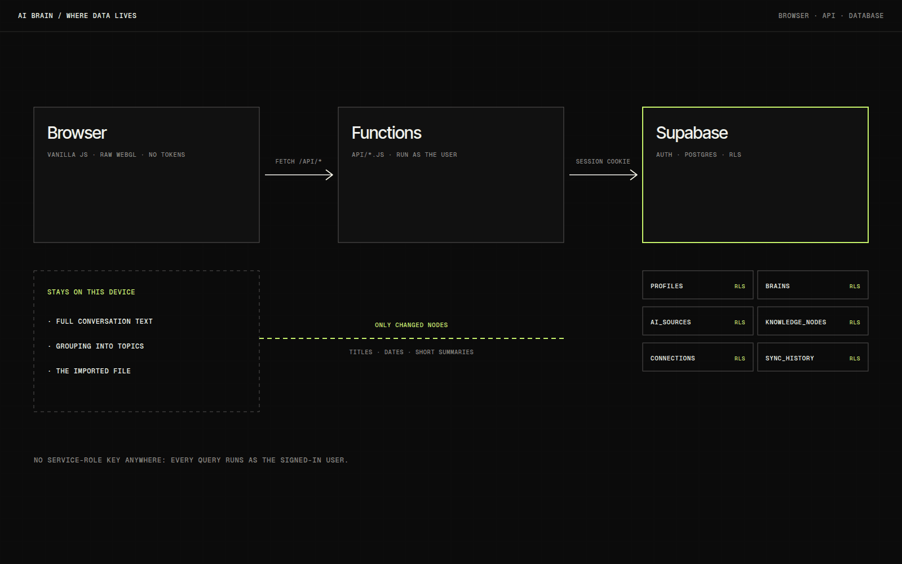
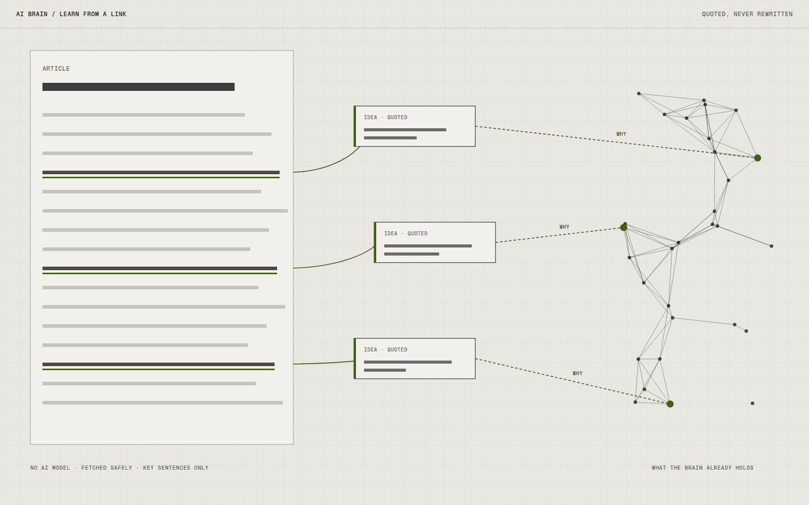

# AI Brain

AI Brain turns the history of my conversations with AI into somewhere I can move around. Exported Claude and ChatGPT chats become knowledge nodes, clusters and connections in a spatial network, with five ways of looking at it. The question was whether memory is easier to use when you can see its shape.

## Overview

The app has five views of one mind: Flow, Orb, Layers, Galaxy and Engine, each on a number key. You sign in, bring in your history, and conversations become nodes that cluster by topic and connect where they relate.

Without any Supabase setup it runs entirely in the browser, with a demo brain and local imports, so it works with no configuration at all.

## The idea

Past conversations are a pile. I kept finding that I had already explored something and could not find where. A map felt like the right shape for that, and I wanted it to feel alive, with nodes that pulse and connections that animate, so that looking at it was a reason to return.

## What I was testing

- Whether five views of the same data each answer a different question, or whether one would be enough.
- Whether grouping and privacy can both be handled in the browser, so full conversation text never leaves the device.
- Whether a link can add knowledge without an AI model, with every key idea a sentence quoted from the page and never rewritten.

## Process

The renderer and the database know nothing about each other. One endpoint returns a plain data model of the brain, nodes and connections, and a small adapter converts it for drawing. The WebGL code never sees a row or a query.

The hard constraint was history. There is no official way for a third-party app to read someone's claude.ai conversations, so the app imports an export file. Nothing is scraped and no passwords are asked for. Grouping happens in the browser, and only derived knowledge, such as topic titles, dates and short summaries, is uploaded, and only for nodes that changed.

Every table has row level security and the server never holds a service-role key, so every query runs as the signed-in user. The tests attack that boundary as a second user and as an anonymous visitor.

*Caption: Conversation text stays in the browser. Only derived knowledge crosses to the API, and the database decides access with row level security.*

## Result

The landing page, demo brain, five views, search, filters, a time slider, Claude and ChatGPT import, accounts and data deletion all exist, with importer, security and browser tests.

A link can be pasted to add its key ideas to the brain. The page is fetched safely, the most distinctive sentence of each section is kept, and each connection says why it exists.

*Caption: Each node is a sentence quoted from the page, connected to what the brain already holds.*

Google and GitHub sign-in have not been run against my own OAuth apps yet, so I treat them as untested.

## Learnings

- Doing the grouping in the browser kept uploads small and kept transcripts private, and it turned out to be the simplest design as well.
- Because history can only come by export, the app is manual by design. A connector that lets Claude add to the brain during new conversations is the more honest next step than any scraping.
- Next on my list are mobile sharing, collections and pre-filled examples.

## Notes

Offline grouping labels are plain vocabulary. An optional pass with Claude on the command line gives better names and learnings.

## Stack

- Vanilla JavaScript
- Raw WebGL
- Vercel Functions
- Supabase
