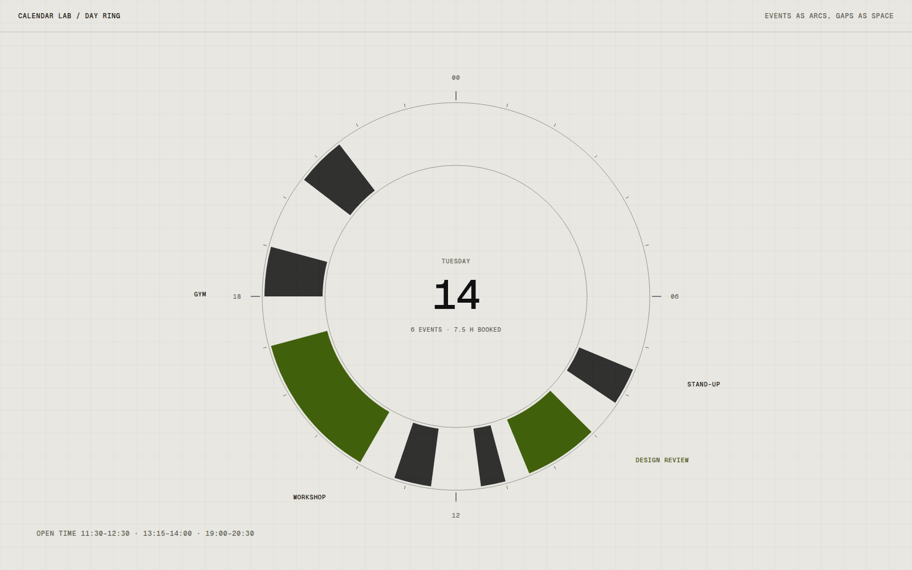

# Calendar Lab

Calendar Lab is a set of calendar views that refuse the grid of equal boxes. A day with one long meeting and a day with six short ones look the same in a normal month view, and I wanted to see what happens when the shape of time is part of the picture.

## Overview

The lab currently holds three views: a dot matrix for a whole month, a ring for a single day, and a strip that lays a week out as one continuous line. They all read from the same small set of sample events.

Every view is still changing. The aim is comparison, not a finished calendar app.

## The idea

A month grid tells you which days have something on them, and very little about what kind of day it will be. I wanted views that answer a different question: where does my attention go, and where is there room?

## What I was testing

- Whether dot size can carry how busy a day is without needing a number.
- Whether a circular day view helps with spotting gaps compared with a vertical timeline.
- Whether one continuous week strip makes rhythm easier to see than seven separate columns.

## Process

I began with the dot matrix because it was the cheapest: one circle per day, radius scaled by booked hours. It read better than I expected, and immediately raised the question of whether hours booked is even the right measure.

The ring came next. It draws the twenty-four hours as a circle with events as arcs, and open time as the space between them. The strip is the newest and least resolved.

*Caption: The day ring with events as arcs. Gaps are visible as empty space rather than as missing rows.*

## Result

The three views exist and respond to the same sample data. Hovering or focusing an event highlights it across every view, and each view can be reached by keyboard. Nothing connects to a real calendar yet.

## Learnings

- Dot size works for a month, but only when the scale is shared across months, so one quiet month does not look busy.
- The ring is good at gaps and poor at order. It is hard to read what comes first without a start marker.
- I still need to decide how these views should handle overlapping events, which is currently the main open question.

## Notes

Colour is intentionally minimal in every view. Event type is carried by shape and position so that the views still work in a single colour.

## Stack

- TypeScript
- SVG
- React
