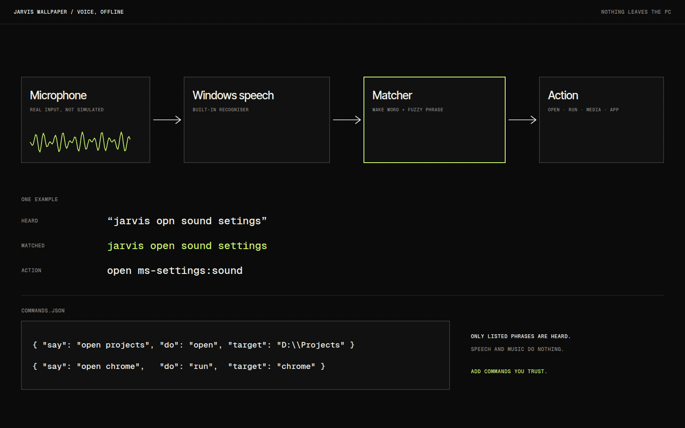

# Jarvis Wallpaper

Jarvis Wallpaper draws my computer as a second-brain star map. CPU, memory, GPU, storage, network, processes and my own voice are hubs, and every core, drive and process is a star sized by its real value. I wanted a desktop that shows what the machine is actually doing.

## Overview

The window shows seven labelled hubs. The stars around them are CPU cores, memory cells, drives, the top processes, upload and download, and twenty bands of my voice. Thin links join hubs to stars, and light pulses travel along them faster when that part of the machine is busy.

There are six modes that show the same live data in different worlds, from Quantum Flow to Neural Brain. Nothing is simulated. Where there is no data yet, the readout shows `--`.

## The idea

I had a visual language for knowledge in AI Brain, and wondered what it would look like applied to something that changes by the second. A computer is a good subject because its activity is real, constant and mostly invisible. The first five modes echo the five views in AI Brain.

## What I was testing

- Whether a star map reads as information and not decoration when size and glow come from real values.
- Whether voice can drive a desktop completely offline, using the speech recogniser built into Windows.
- Whether the same live data can morph between six visual worlds without losing its meaning.

## Process

The voice part took the most care. Commands are a wake word and a phrase, and only listed phrases are recognised, so ordinary speech or music does nothing. Matching is forgiving: the wake word tolerates common mishearings, and phrases are fuzzy-matched, so a slightly garbled command still works.

I added a commands file so new commands are a line of JSON each. A command can open a folder or a link, run a program, press a media key or control the wallpaper itself.

Most of the rest of the effort went into making failure visible: a status line, a box showing what Windows heard, a simulated command and a voice log.

*Caption: A schematic of the voice path. Recognition is offline, and matching is deliberately forgiving.*

## Result

A Windows installer is built through GitHub Actions and controlled from a tray icon. It is unsigned, so Windows asks for confirmation on first run.

Window mode is reliable. Wallpaper mode, behind the desktop icons, is experimental and cannot be clicked.

## Learnings

- Most of the voice troubleshooting turned out to sit outside the code: microphone volume, the Windows speech language, and microphone permission for desktop apps.
- Some readings only appear when Windows exposes them, such as GPU load and CPU temperature, so the map has honest gaps.
- The visuals react to the microphone and not to system audio. Next I want to decide whether wallpaper mode can be made interactive at all.

## Notes

Only add voice commands you trust, because a command can run a program.

## Stack

- Electron
- systeminformation
- Windows speech recogniser
