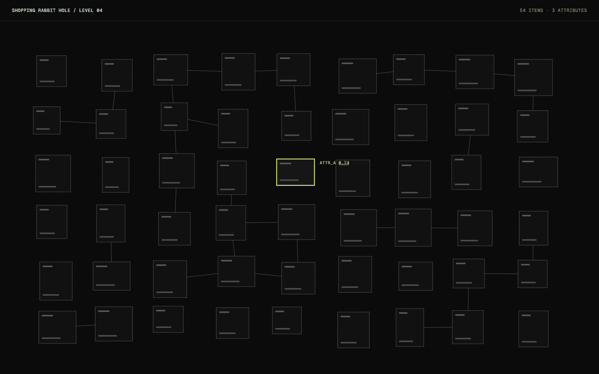

# Shopping Rabbit Hole

Shopping Rabbit Hole is a study of how browsing turns into buying. Every item you select does not open a product page. It opens a denser field of similar items, and the page keeps narrowing until there is very little left to compare.

## Overview

The page starts with a loose grid of placeholder products. Choosing one replaces the grid with a tighter set of lookalikes, then a tighter set again, and each step tightens the layout and the language. It is a deliberately uncomfortable interface.

It is archived as a finished study. I built what I needed to answer the question, and stopped.

## The idea

I spend a lot of time around commerce interfaces, and the patterns that make browsing feel effortless are the same ones that make it hard to stop. I wanted to build the pattern in its purest form, without any real products, to see what it feels like when the only goal is the next click.

## What I was testing

- How quickly a page can feel like a tunnel when every choice narrows the next one.
- Which visual cues carry the pull: repetition, density, the word "similar", or the absence of a back button.
- Whether the effect survives once I can see exactly how it is built.

## Process

The catalogue is invented: grey shapes with short names, so that nothing real is being sold. Each level is generated from the previous selection by picking the nearest items on a few made-up attributes.

I made three versions of the copy. One said "similar items", one said "more like this", and one said nothing at all. The wordless version pulled the least, which was a useful result on its own.

*Caption: Lines between tiles show the made-up attributes that decide which items appear next.*

## Result

The study is complete and preserved here as documentation. The prototype went seven levels deep, after which the page ran out of items and reset, which I found more revealing than I expected.

## Learnings

- Density did more of the work than wording. Shrinking the tiles felt more compelling than any label.
- Removing the back control made the tunnel feel physical, and it also made me uneasy using my own page.
- I would not turn this into a product. The useful outcome was a vocabulary for what I want to avoid.

## Stack

- Next.js
- CSS
- Hand-made placeholder catalogue
