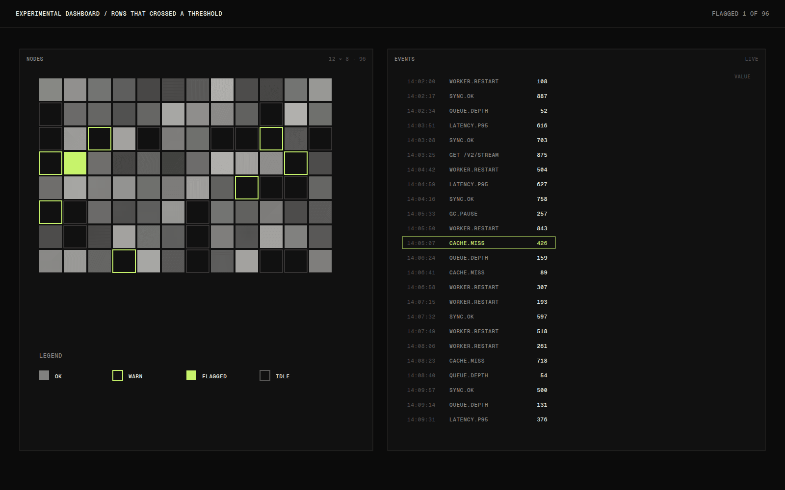

# Experimental Dashboard

Experimental Dashboard is a single dense screen for watching a system that keeps changing. The system is simulated, which is deliberate: I wanted to test how much a screen can hold and still be readable, without a real product dictating the content.

## Overview

The screen combines a live line chart, a histogram, a matrix of status squares, small sparkline tiles and a rolling event log. A simulator produces the data, and the dashboard subscribes to it the way it would to a real service.

## The idea

Dashboards tend to fail in one of two ways: too sparse to be useful, or so full that nothing can be found. I was curious about the narrow band between them, and what layout rules would keep a dense screen calm.

## What I was testing

- Whether a strict grid and a tiny type scale can keep a crowded screen legible.
- Whether change can be shown without motion everywhere: which updates deserve to animate, and which should simply replace a value.
- How the screen reads when the stream gets noisy, when many values change at once.

## Process

I started with a fixed twelve-column grid and four panel sizes, then added panels until the screen started to feel stressful. That point was the useful limit. I removed the last two panels and tightened the spacing instead.

Motion came last. Only things that cross a threshold animate, and only by flashing their border once. Everything else updates in place, silently.

*Caption: The status matrix and event log at full density. Only rows that crossed a threshold are flagged.*

## Result

The dashboard runs against a built-in simulator that produces steady traffic, bursts and the occasional fault, and it can be replayed from a fixed seed so the same session can be compared across design changes.

## Learnings

- Consistent alignment mattered more than fewer panels. Unaligned numbers were what made the screen feel busy.
- Quiet by default works, but only if the exceptions are unmistakable. The single border flash was enough.
- A simulator is a design tool in its own right. Being able to replay a bad minute made the layout easier to fix.

## Notes

Because the data is simulated, nothing here says anything about how a real system would behave. It is a study of presentation.

## Stack

- Next.js
- TypeScript
- Server-sent events
