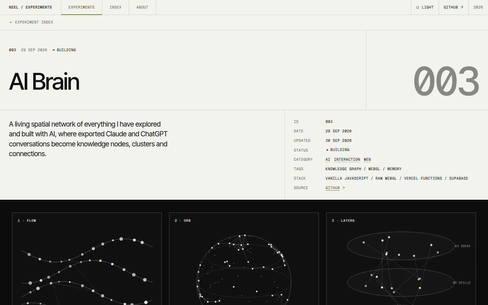

# NEEL / EXPERIMENTS

This is the archive you are reading: a public place for the things I build, test and abandon. I wanted it to behave like a research notebook and not a portfolio, so every entry is a folder of Markdown, and nothing on the site is typed in twice.

## Overview

The site is a dark editorial grid with a light variant that reads as printed paper. Entries are Markdown files with frontmatter. The counts on the home page, the category pages, the archive, the directory filters and the sitemap are all derived from those files.

Publishing is adding a folder to the repository and pushing it.

## The idea

I keep starting small projects out of curiosity, and most of them end up described only in a conversation or a README. An archive felt like the right container, but only if adding to it cost almost nothing. If publishing needed code changes, I would stop doing it.

## What I was testing

- Whether a structured Markdown folder can be the whole CMS, with no database and no admin screen.
- Whether a grid made of thin rules, not cards, can still feel like a product.
- Whether theme, filters and layout can all be solid without shipping much JavaScript.

## Process

The grid is real structure. Each cell draws its own 1px rule, which gives exact lines whatever the column spans are, and a sub-grid keeps images and text aligned across a row of tiles.

Content is validated at build time, and a mistake fails the build with the file and the reason: a bad date, an unknown category or a duplicate id. Drafts never reach production.

Theme choice is applied by a tiny script before the first paint, so there is no flash, and filters live in the address bar so any filtered view can be shared.

*Caption: The experiment page in the light theme. The grid and hierarchy are the same as in the dark theme.*

## Result

The site builds statically and has a home page, a filterable directory, experiment pages, categories, a chronological archive and an about page. It has generated share images, a sitemap, structured data and a unit test suite, and an accessibility audit reported no violations in either theme.

It is not deployed yet, so I am calling it building.

## Learnings

- The light accent from my brief failed contrast for small text, so I darkened it. The original was 4.2:1 against the page.
- Arrows and status symbols are drawn as SVG. The fonts I chose do not include them, and a fallback font would draw them differently on every device.
- A new entry folder needs a restart of the local dev server before its page appears, which is the one rough edge in the workflow.

## Stack

- Next.js
- TypeScript
- Tailwind CSS
- MDX
