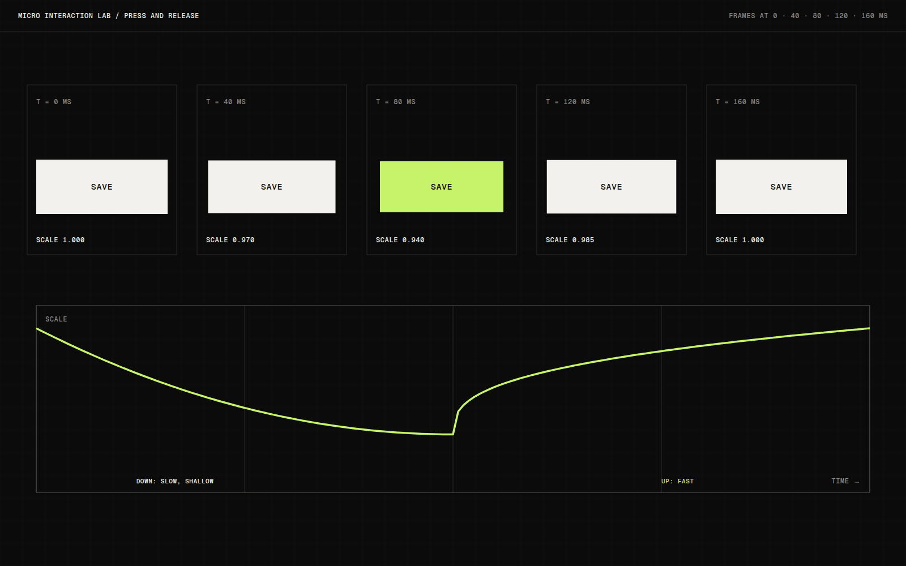

# Micro Interaction Lab

Micro Interaction Lab is a growing set of small studies on single controls: a toggle, a slider, a checkbox, a press. Each one is an answer to a narrow question about feedback, and each lives on a sheet where it can be compared with the others.

## Overview

The lab is a grid of independent studies. Every cell shows one control in all of its states, along with the timing it uses, so the set can be read as a catalogue as well as played with.

## The idea

Controls are where an interface touches you most often, and they are usually the least examined part. I wanted to slow down and treat each one as its own small design problem, instead of inheriting them from a component library.

## What I was testing

- How much a control can say about its state using only shape and timing, with no colour change.
- What the smallest useful press feedback looks like, and where it becomes distracting.
- Whether keyboard focus can feel as considered as hover.

## Process

Each study starts with a question written above the control, such as "what does off look like?" or "when does a press start?". I build the smallest version that answers it and write down what I noticed.

I put the states in a row, including focus and disabled, before refining any animation. A control that only looks right in its active state has not been designed yet.

*Caption: Press feedback broken into frames. The scale change is small, and most of the feeling comes from how quickly it returns.*

## Result

Twelve studies exist, along with a sheet that lays them out together. New ones are added as separate cells, so earlier studies never need to change when a later one is built.

## Learnings

- Return speed is more important than press depth. A quick release made even a tiny press feel physical.
- Focus rings deserve the same attention as hover. They are the only feedback a keyboard user gets.
- Some controls are finished the moment they feel obvious. Stopping there was harder than expected.

## Stack

- CSS
- TypeScript
