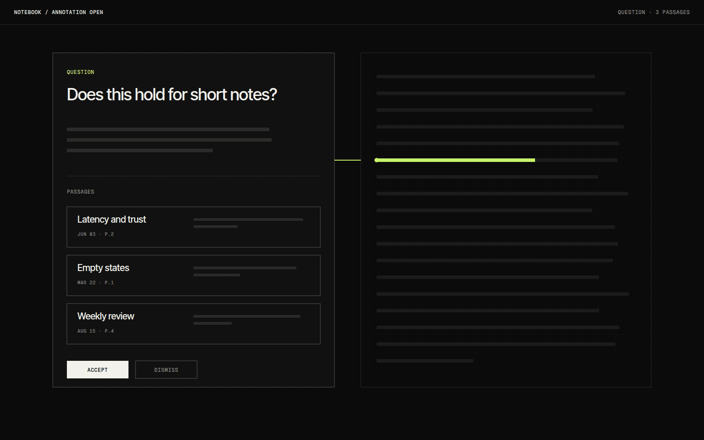

# AI Notebook

AI Notebook is a research and note-making workflow where the AI stays in the margin. I write in the main column as usual, and suggestions, related notes and questions appear beside the line they refer to, where I can ignore them or pull one in.

## Overview

The notebook is a single page of writing with a narrow margin on the right. The margin shows short annotations: a related passage from an earlier note, a missing source, or a question about a claim. Nothing is inserted into the text unless I choose to.

It is still being built. The writing surface and the margin both work, and the quality of the suggestions is the part that needs the most work.

## The idea

Most AI writing tools work by producing text for me. I wanted to test the opposite: a tool that reads what I am writing and only points at things, leaving the sentences mine. The margin is an old pattern from annotated books, and it seemed like the right place for something that should help without taking over.

## What I was testing

- Whether suggestions beside the text are less disruptive than suggestions inline.
- Whether every annotation can link to a specific line, so it is clear what it is about.
- How little an annotation needs to say to still be worth reading.

## Process

The first version put suggestions in a side panel with no connection to the text, and I never looked at it. Attaching each note to a line with a thin connector fixed that immediately, because I could see what each suggestion was about without reading it.

Annotations are limited to a short sentence and a source. Anything longer has to be opened deliberately, in a separate view.

*Caption: Opening an annotation shows the passages behind it, so I can check the reasoning before accepting anything.*

## Result

Writing, margin annotations and the detail view exist. Retrieval runs on local embeddings of my own notes. Annotations sometimes point at the wrong line when a paragraph is edited quickly, and I have not yet found a stable way to anchor them.

## Learnings

- Anchoring to a line made suggestions feel like reading, not interruption.
- Limiting annotation length did more for trust than improving their wording.
- Next I want to test letting annotations expire, so the margin does not slowly fill up.

## Stack

- Next.js
- TypeScript
- Local embeddings
