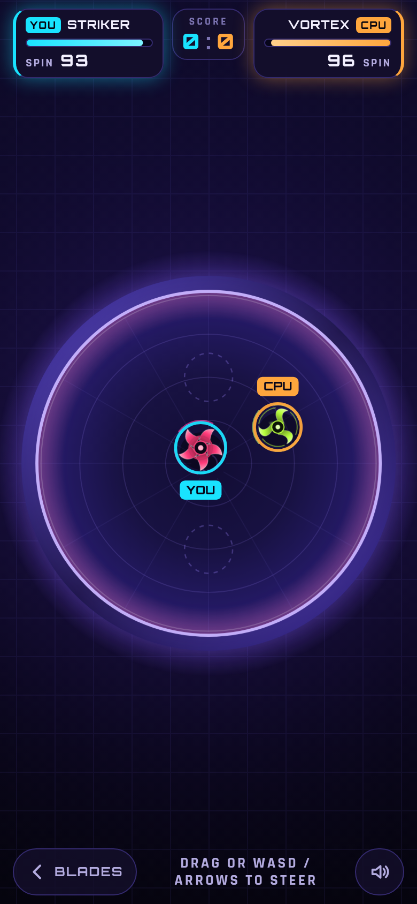
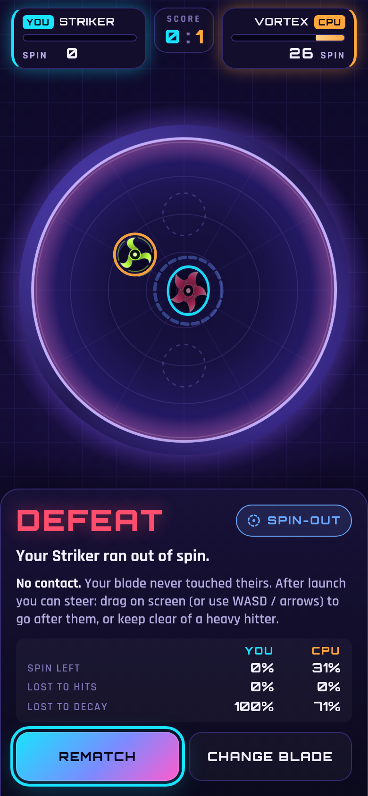

# Spinblade Arena

Spinblade Arena is a one-page browser game where two spinning tops fight in a bowl until one is pushed out or runs out of spin. I built the MVP slice of a PRD to see how much weight and legibility I could get from Canvas 2D, vanilla JavaScript and no backend.

## Overview

You pick one of three blades, pull back and release to launch, then steer lightly while the physics plays out. The loop is choose a blade, launch, battle, result, rematch. A typical fight lasts 15 to 40 seconds.

Everything is in one HTML file plus a small service worker, so it keeps working offline. There are no accounts, no analytics and no network calls.

## The idea

A fight this short has to stay readable on a phone. When a blade loses, the player should know why, and the three blades should relate to each other in a way that can be learned in one or two rounds.

## What I was testing

- Whether a counter-triangle (Striker beats Vortex, Vortex beats Aegis, Aegis beats Striker) can emerge from knockback, spin damage, mass and decay instead of being hard-coded.
- Whether light steering, which costs spin, reads as skill and not as noise. The PRD flagged this as an open question.
- Whether the end of a fight can explain itself: a chip, a sentence and a banner name the ring-out or spin-out at the moment it happens.

## Process

Physics runs on a fixed 120 Hz step with impulse collisions, spin decay and a bowl that pulls blades towards the centre. Every tunable sits in two objects at the top of the simulation block, each with a comment.

A headless script, `tools/balance.mjs`, runs the same simulation CPU against CPU and checks it against the design targets. Each counter must win from both seats, mirror matches should be coin flips, and fights should be neither instant nor endless. It caught a seat bias early, because the player always sits at the bottom. I fixed it.

The CPU has a different behaviour per blade: Striker chases, Aegis holds the centre and intercepts, Vortex evades and hits and runs. It steers with the same acceleration and spin cost as the player.

*Caption: A battle in progress. The spin meters sit in the HUD, and the rim glows as a blade nears it.*

## Result

A playable MVP: three blades, a CPU opponent, a running score, rematch and change blade. It runs by opening `index.html` or serving the folder. There is no hosted version linked yet.

Game feel is mostly cheap tricks: sparks, shock rings, screen shake, hit-stop on heavy collisions and synthesised sound. With reduced motion on, the shake, sparks and hit-stop go away and the loop stays fully playable.

*Caption: The result screen names the cause and shows where the spin went. When a loss had no contact at all, it adds a tip that the player can steer.*

## Learnings

- Hit-stop on heavy collisions is the cheapest way to make hits feel heavy.
- Contact needed a small kick that pushes blades apart. Without it, two blades could jam at the centre.
- The counters are close to locks in CPU-against-CPU runs, which is not what I want for people. The human win rates are still unchecked.
- Ring-outs are mostly Striker's win condition. If real players push opponents to the wall less than the CPU does, I will loosen the rim lip or raise the knockback exponent.
- Next: playtest whether steering reads as skill, and decide how to collect play-again rate and time to first launch from real players without adding network calls.

## Notes

Add `?debug` to the URL for an on-screen panel with frame rate, slow frames, battles, rematch rate and time to first launch. The counters are kept locally only.

The fonts, Orbitron and Rajdhani, are embedded as base64 subsets under the SIL Open Font License, so nothing is fetched at runtime.
