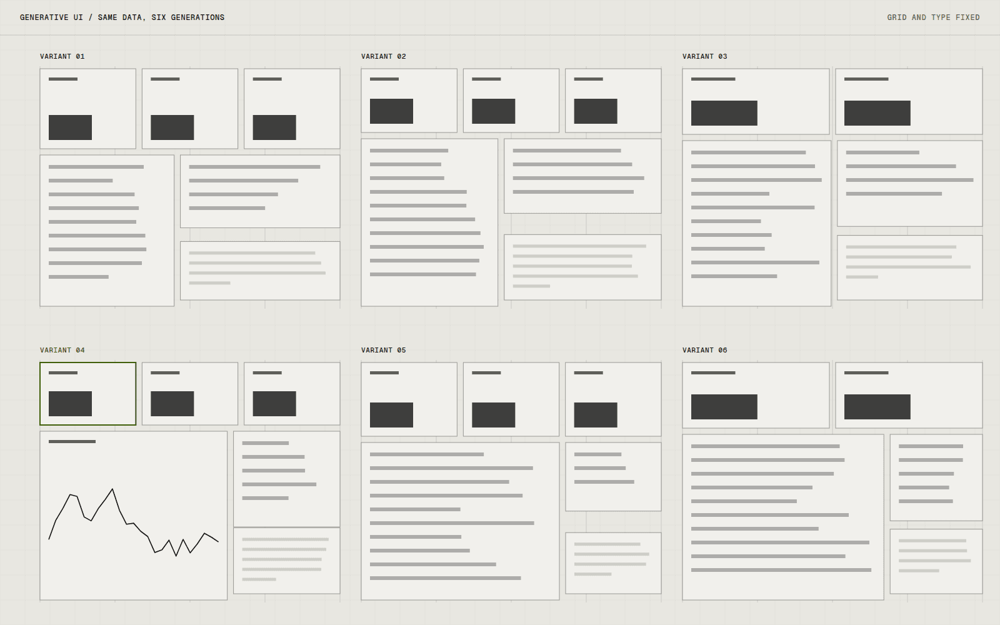

# Generative UI

Generative UI is a two-week study of interfaces produced from structured data and a small set of layout rules. The question was how much a model can decide about a screen before the result stops being coherent, and where the rules have to take over.

## Overview

The study takes a block of structured data, such as a list of items with types and priorities, and generates a layout from it. A model proposes the arrangement and a fixed layout engine turns it into a screen, rejecting anything that breaks the rules.

It is archived. I answered the question I had, and continuing would have meant building a product rather than running a study.

## The idea

There is a lot of talk about interfaces that generate themselves. I wanted to find the boundary myself: which decisions are safe to delegate, and which need to stay in a fixed system of rules.

## What I was testing

- Whether a model can choose sensible layouts when it only picks from a fixed set of components.
- Whether a rule engine that rejects bad output is enough to keep the result consistent.
- How different the screens look when the same data is generated several times.

## Process

The first attempt let the model write layout freely, and the results were interesting individually and incoherent together. Every screen looked different for no reason that was visible in the data.

The second version limited the model to choosing from a short list of panel types and spans, with a rule engine checking the result against the grid. The output became repetitive in a good way: recognisably one system, with variation coming from the data.

*Caption: The same data generated six times. The arrangement varies, and the grid, spacing and type stay fixed.*

## Result

The study produced a working generator with about a dozen panel types and a rule checker, plus the sheet of variations above. It is not public, and it was never meant to be.

## Learnings

- Constraints made the output better. The model was more useful choosing between options than inventing them.
- A rule engine that explains why it rejected a layout is worth building early, because it doubles as debugging output.
- The remaining question is whether people would want screens that vary at all. I did not test that.

## Notes

Two weeks was the right size for this. Left open-ended, it would have turned into building a component library.

## Stack

- TypeScript
- JSON Schema
- OpenAI API
